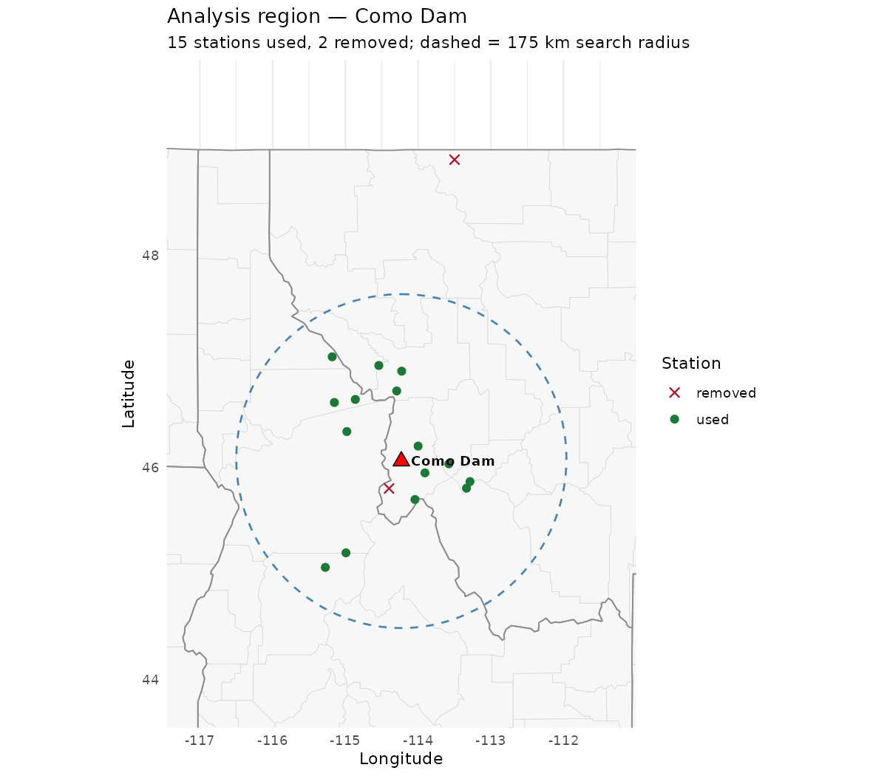
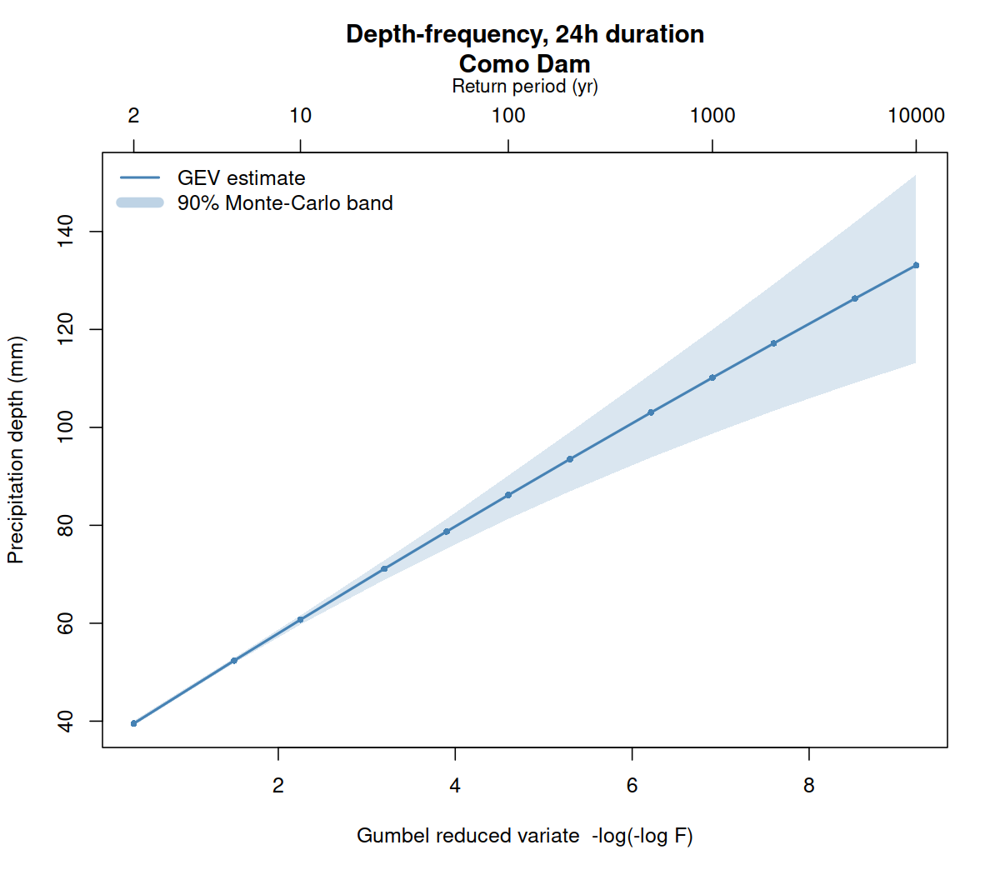

# L-moments-hub

Regional precipitation-frequency analysis by **L-moments** (Hosking &amp; Wallis,
1997), implemented in R — from a single dam to a **national-scale** sweep of the
entire U.S. dam inventory. Primary test site: **Como Dam**, Bitterroot Valley,
Montana; the pipeline is **portable** — one config analyses any basin.

## Highlights

What this project pulls together, end to end:

- **National scale from one codebase.** The *same* validated pipeline runs a
  single dam, the **308-dam Bureau of Reclamation fleet**, and the **entire
  73,303-dam National Inventory of Dams** — a single YAML/manifest is the only
  thing that changes.
- **Real observations, not toy data.** Pulls real **GHCN-Daily** precipitation
  from NOAA's AWS Open-Data mirror (worked around blocked NCEI/CRAN egress), with
  **QA-flag quality screening** and a **committed cache** so every run reproduces
  offline — 4,400+ stations cached and growing.
- **Verified against the textbook and by hand.** Built on Hosking's own reference
  `lmomRFA`, then *independently* checked: it **reproduces the Hosking &amp; Wallis
  (1997) worked-example findings**, and its index-flood depths match a
  **from-scratch hand-calculation to 0.000%** through the 10,000-year event. Runs
  are seeded and bit-for-bit reproducible. → [`docs/VALIDATION.md`](docs/VALIDATION.md)
- **Built to actually finish 73k dams.** A **resumable** driver with a committed
  ledger processes the fleet in tranches (largest dams first), never recomputes a
  dam, and a **nightly job carries the sweep forward on its own** — engineered for
  an ephemeral machine that can't hold a two-week run.
- **Reviewer-ready, not a black box.** Every run emits a full **audit trail**:
  region maps, used/removed station lists with reasons, L-moment ratio diagrams,
  DDF tables with Monte-Carlo bounds, **per-facility triage diagnostics**, a
  **distribution tail-sensitivity** analysis, an **expert distribution-review**
  workflow, and a provenance manifest — plus a technical-basis doc, an
  assumptions register, an output data dictionary, a per-facility sign-off
  checklist, and a NOAA Atlas 14 cross-check tool.
- **Honest about its limits.** Every input is treated as **unverified**; the tool
  is framed as a **research / triage screen** that flags where an expert should
  look, explicitly **not** a source of engineering numbers. The rigor is in
  saying so.
- **Region construction is a choice, not a given.** Alongside the default
  circular-radius region, `region.method: cluster` builds the homogeneous
  region by H&amp;W (1997) sec. 9.2.3 Ward's-method clustering — and
  `compare_regions.R` shows exactly how much the choice moves the DDF curve
  for a facility. Measured fleet-wide on the 308-dam BOR set with both
  methods run under identical inputs (`docs/CLUSTER_FLEET_RESULTS.md`): the
  choice moves the 10,000-yr depth by **median 15% (mean 20%)**, with half
  of facility×duration combinations moving more than 15% — a quantified
  uncertainty component, not a cosmetic option.
- **Uncertainty you can read per facility.** Because the region-building
  choice moves the tail that much, the pipeline ships a per-facility
  **region-method band** (`region_band_pct_10k` plus a review flag) alongside
  the depths — the regionalization component the Monte-Carlo bounds
  deliberately exclude. A region-of-influence assignment variant removes most
  of the extreme disagreements, which turn out to be small-donor-pool
  sampling variance rather than climate signal.
- **ASM and ARF, exposed and applied.** The at-site mean (index flood,
  already computed) is now reported on every deliverable, and an Areal
  Reduction Factor (Leclerc &amp; Schaake 1972, swappable) is applied wherever
  a drainage area is on file — additive alongside, never replacing, the point
  depth.

## Scope &amp; progress

The project grew from a single dam to a national sweep, validating at each step
before scaling up. It is being handed off to **Reclamation flood-hydrology
experts** as a **research / triage** tool — a first-pass screen that flags which
dams and regions need an expert's attention, **not** a source of engineering
numbers on its own.

| Stage | Scope | Status |
|---|---|---|
| **1. Como Dam** | 1 site (Montana), full audit trail | ✅ validated on real GHCN data |
| **2. BOR fleet** | **308** Bureau of Reclamation dams (`run_batch.R`) | ✅ complete — **305 ok / 3 failed** (the 3 lack enough nearby gauges to form a region) |
| **3. Full NID** | **73,303 dams** — the entire National Inventory of Dams (`run_nid_tranche.R`) | 🔄 underway — **50,750 done (69%)**, 50 genuine failures, via a self-chaining GitHub Actions batch in 75-dam resumable tranches (see batch plan below). Run 2, a **second full pass under the cluster method** keeping both datasets, is **prepped and ready to launch** on branch `claude/nid-run2-cluster`: [`docs/NID_RUN2_CLUSTER_PLAN.md`](docs/NID_RUN2_CLUSTER_PLAN.md) |

**First-look analyses and QC (2026-08-16, partial data).** With the fleet at
~42%, layered QC gates (`qc/`, per `docs/NID_QAQC_PLAN.md`) and three
first-look analyses (`docs/analysis/`: failure/gauge-desert atlas,
tail-behavior geography, heterogeneity hot-spots) ran against the partial
ledger. The QC pass found and same-day-fixed two live fold-in bugs (cohort
boundary `c664dd32`; a 4,087-facility remediation re-run is queued —
`qc/reports/rerun_cohort.csv`). Completion steps are scripted in
`docs/NID_COMPLETION_RUNBOOK.md`; the analysis roadmap is
`docs/NID_ANALYSIS_PLAN.md`.

**Batch plan for the full NID.** 73,303 dams is ~2 weeks of compute and many GB
of weather data — too large for one run on an ephemeral machine. So
`run_nid_tranche.R` processes the fleet in **resumable tranches**, largest-storage
dams first, recording every attempted facility in a **committed ledger**
(`data/nid_progress/`) so no dam is ever computed twice and each night's run
continues exactly where the last stopped:

- a **self-chaining GitHub Actions job** works down the fleet automatically —
  each run spends its time budget on ~75-dam tranches, then dispatches its own
  successor, so the fleet advances unattended;
- live tally: [`data/nid_progress/progress.md`](data/nid_progress/progress.md);
  the small resume ledger stays in git, while the **large cumulative tables are
  published as compressed release assets** (tag `nid-run1-data`) that each job
  restores before its first tranche and re-uploads after every round. That
  replaced Git LFS in-flight on 2026-08-17: per-tranche LFS churn was
  accumulating ~75 GB/day, and GitHub degrades over-quota LFS *downloads* to
  pointer files — which would have broken the chain, not just billed for it.
  A consistency manifest (`nid_state.json`) fails a job loudly if the ledger
  and the assets ever disagree.

Every input — the GHCN-Daily weather **and** the NID dam inventory — is
**UNVERIFIED** and requires expert review before any engineering use. See
[`DATA_SOURCES.md`](DATA_SOURCES.md).

## ✅ Validation — start here

Because the results are meant for expert hand-off, **how we know the pipeline is
correct** is the most important thing to read:
**[`docs/VALIDATION.md`](docs/VALIDATION.md).**

The L-moment core is Hosking's own `lmom`/`lmomRFA` (he co-authored the method),
so it is a reference implementation by construction. On top of that,
`Rscript validate_reference.R` independently confirms the layers this project
adds — and all checks pass:

- reproduces the **Hosking &amp; Wallis (1997) textbook** findings on their own
  `Appalach` (heterogeneous) and `Cascades` (homogeneous) example datasets;
- the index-flood depth calculation equals an **independent from-scratch
  hand-calc** (base `lmom` only) to **0.000%** through the 10,000-year depth;
- discordancy matches `regtst` exactly, selection matches the expert hand-rule,
  and seeded runs are bit-for-bit reproducible.

## Example outputs

Real artifacts from actual project runs live in
[`docs/example_outputs/`](docs/example_outputs/):

**One facility (Como Dam)** — the full deliverable set a reviewer signs off on:

|  |  |
|:--:|:--:|
| Region: stations used vs removed | 24-hour depth-duration-frequency with Monte-Carlo bounds |

- [`report_COMO_DAM.html`](docs/example_outputs/report_COMO_DAM.html) — self-contained HTML audit report
- [`quantiles_DDF_COMO_DAM.csv`](docs/example_outputs/quantiles_DDF_COMO_DAM.csv) — depth-duration-frequency table
- [`stations_used_COMO_DAM_24h.csv`](docs/example_outputs/stations_used_COMO_DAM_24h.csv) / [`stations_removed…`](docs/example_outputs/stations_removed_COMO_DAM_24h.csv) — region composition with reasons
- [`run_manifest_COMO_DAM.json`](docs/example_outputs/run_manifest_COMO_DAM.json) — provenance manifest
- plus the [L-moment ratio diagram and growth-curve fit](docs/example_outputs/figures/)

**The 308-dam BOR fleet** — the fleet-level summary of a full batch run:
[`docs/example_outputs/fleet_308dam/`](docs/example_outputs/fleet_308dam/)
([README](docs/example_outputs/fleet_308dam/README.md)) — per-facility status,
the combined DDF table, triage diagnostics (H1 / chosen distribution / `needs_review`),
and the distribution tail-sensitivity table.

## What it produces

For each configured duration (default **24-hour** and **72-hour**) and out to the
**10,000-year** return period (annual exceedance probability 1e-4):

- a **homogeneous region** defined by the discordancy measure *Dᵢ* and the
  heterogeneity measure *H* (iteratively refined, every decision logged);
- a **map** of the region (stations used vs removed, dam, search radius);
- **lists** of stations **used** and stations **removed** (with reasons);
- an **L-moment ratio diagram** and a **growth-curve fit plot** showing the
  station data against the candidate distributions (basis for the choice);
- **depth-duration-frequency** tables and curves with **Monte-Carlo uncertainty
  bounds**;
- a self-contained **HTML audit report** and a **provenance manifest** for review.

## Method (Hosking &amp; Wallis 1997)

1. **Screening** — discordancy *Dᵢ* flags/removes anomalous stations.
2. **Homogeneity** — heterogeneity *H* defines an acceptably homogeneous region.
3. **Distribution choice** — L-moment ratio diagram + *Z*-statistic goodness-of-fit
   (GLO / GEV / GNO / PE3 / GPA).
4. **Estimation** — index-flood regional growth curve; site quantiles
   *Q(F) = index_flood × q(F)*; uncertainty by parametric bootstrap.

Built on Hosking's own **`lmom`** and **`lmomRFA`** packages (the reference
implementation of the book).

## Quick start

```bash
# Install R packages (see docs/users_guide.md for offline/CRAN-mirror options)
Rscript -e 'install.packages(c("lmom","lmomRFA","yaml","jsonlite","ggplot2","sf","maps"))'

# Validate: known-answer golden set, unit/integration tests, and the
# textbook + independent hand-calc reference checks (see docs/VALIDATION.md)
Rscript run_golden.R
Rscript run_tests.R
Rscript validate_reference.R

# Run the analysis for Como Dam. Weather is real GHCN-Daily via the AWS S3
# mirror where reachable; on a fully offline host it falls back to a clearly
# LABELLED synthetic demo set so the pipeline still runs end-to-end.
Rscript run_analysis.R config/como.yml
```

Outputs are written to `outputs/` (figures, tables, `report_<id>.html`,
`provenance/`). Curated example outputs are in
[`docs/example_outputs/`](docs/example_outputs/) (see above).

## Analyse another basin / the fleet

Copy `config/como.yml`, edit the `site:` block (and any parameters), then:

```bash
Rscript run_analysis.R config/mybasin.yml            # one basin
Rscript run_batch.R --manifest config/facilities_BOR.csv  # the 308-dam BOR fleet
Rscript run_nid_tranche.R                            # next tranche of the full NID (resumable)
```

> **⚠️ Data review required.** Both the **weather source** (GHCN-Daily) and the
> **dam inventory** (`config/facilities_BOR.csv` — 308 BOR dams; `config/nid_manifest.csv`
> — the full 73,303-dam NID; coordinates from a third-party ~2013 NID mirror, no
> ground elevations) are **UNVERIFIED** and must be reviewed before any
> engineering use — see **[`DATA_SOURCES.md`](DATA_SOURCES.md)**. Real weather is
> pulled from the **AWS Open-Data GHCN mirror** (this environment blocks NOAA NCEI
> and CRAN; packages are built from the public CRAN GitHub mirrors); on a fully
> offline host, runs fall back to a clearly labelled **synthetic** demo set.
> **Synthetic or unverified-inventory results are not valid for engineering decisions.**

## Documentation

- **[`docs/VALIDATION.md`](docs/VALIDATION.md)** — how the pipeline is verified (start here)
- **[`docs/METHODS.md`](docs/METHODS.md)** — technical basis: equations, thresholds, choices
- **[`docs/ASSUMPTIONS_AND_LIMITATIONS.md`](docs/ASSUMPTIONS_AND_LIMITATIONS.md)** — what to keep in mind before trusting a number
- **[`docs/expert_review_checklist.md`](docs/expert_review_checklist.md)** — per-facility sign-off form for reviewers
- **[`docs/OUTPUT_DATA_DICTIONARY.md`](docs/OUTPUT_DATA_DICTIONARY.md)** — column definitions for every output CSV
- **[`docs/atlas14_comparison.md`](docs/atlas14_comparison.md)** — protocol for the external NOAA Atlas 14 cross-check (`compare_atlas14.R`)
- **[`DATA_SOURCES.md`](DATA_SOURCES.md)** — data provenance and review requirements

**Region-method work** (Reclamation reviewer feedback, quantified):
- **[`docs/REGION_METHOD_SENSITIVITY.md`](docs/REGION_METHOD_SENSITIVITY.md)** — per-facility circular-vs-cluster comparisons (Como, Hoover)
- **[`docs/CLUSTER_FLEET_RESULTS.md`](docs/CLUSTER_FLEET_RESULTS.md)** — the clean fleet-wide measurement, its confound, and how the confound was caught and eliminated

**NID fleet operations** (the 73,303-dam national run):
- **[`docs/NID_QAQC_PLAN.md`](docs/NID_QAQC_PLAN.md)** — the QC gates every result passes before analysis, and the known-issue register
- **[`docs/NID_ANALYSIS_PLAN.md`](docs/NID_ANALYSIS_PLAN.md)** — what to learn from the output, phased, with the public/private publication boundary
- **[`docs/NID_COMPLETION_RUNBOOK.md`](docs/NID_COMPLETION_RUNBOOK.md)** — the ordered procedure for finishing run 1 (self-contained; anyone can execute it)
- **[`docs/NID_RUN2_CLUSTER_PLAN.md`](docs/NID_RUN2_CLUSTER_PLAN.md)** — the second national run under the cluster method, and why both datasets are kept
**Findings and validation** (`docs/analysis/`, all pinned to a fleet commit):
- **[`failure_atlas.md`](docs/analysis/failure_atlas.md)** · **[`tail_geography.md`](docs/analysis/tail_geography.md)** · **[`method_diagnostics.md`](docs/analysis/method_diagnostics.md)** — first-look national patterns (gauge deserts, extreme-rain tail geography, heterogeneity hot-spots), partial data pending completion
- **[`bor_nid_reproducibility.md`](docs/analysis/bor_nid_reproducibility.md)** — the same dams through two pipelines months apart: **99% byte-identical** under matched inputs; every disagreement traced to a dated config change
- **[`atlas14_pilot.md`](docs/analysis/atlas14_pilot.md)** — external validation against NOAA Atlas 14: endpoint contract, a 3,762-value ground-truthing pass with zero mismatches, and the finding that **Oregon and Washington have no Atlas 14 at all** (1,602 dams still governed by 1973 Atlas 2)
- **[`cross_duration_consistency.md`](docs/analysis/cross_duration_consistency.md)** — why ~15% of facilities show 72-h depths below 24-h depths in the far tail, the exact mechanism (directional distribution-family selection), and what NOAA does about it
- **[`nid_coordinate_defects.md`](docs/analysis/nid_coordinate_defects.md)** — 12 apparent coordinate errors that turned out to be **stale in our mirror, correct upstream**; results unaffected
- **[`docs/PLAN.md`](docs/PLAN.md)** — full design · **[`docs/users_guide.md`](docs/users_guide.md)** — how to run · **[`docs/audit_guide.md`](docs/audit_guide.md)** — audit procedure

## License

The **code** in this repository is released under the **MIT License** — see
[`LICENSE`](LICENSE). As MIT states, the software is provided "as is", without
warranty; this reinforces the research/triage framing above — **results are not
valid for engineering decisions without expert review.**

**Data is not covered by the MIT license.** Bundled or downloaded datasets come
from public third-party sources under their own terms and remain the property of
those providers:

- **GHCN-Daily** precipitation (`data/ghcn_prcp_cache/`, `data/ghcn_inventory/`) —
  NOAA/NCEI, a U.S. Government public-domain product, retrieved via the AWS
  Open-Data mirror.
- **Dam inventory** (`config/facilities_BOR.csv`, `config/nid_manifest.csv`) —
  derived from a third-party mirror of the USACE National Inventory of Dams.

Attribute the original providers when reusing the data, and see
[`DATA_SOURCES.md`](DATA_SOURCES.md) for provenance and the **unverified-data**
caveats. Third-party R packages (`lmom`, `lmomRFA`, etc.) are dependencies under
their own licenses and are not redistributed here.
