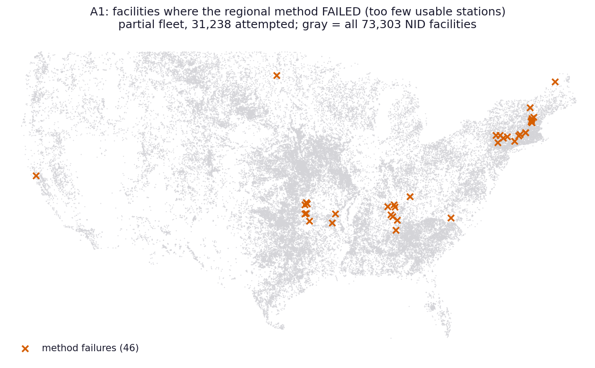
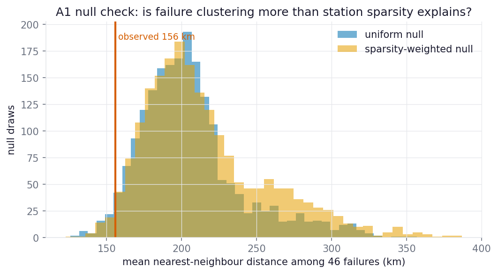
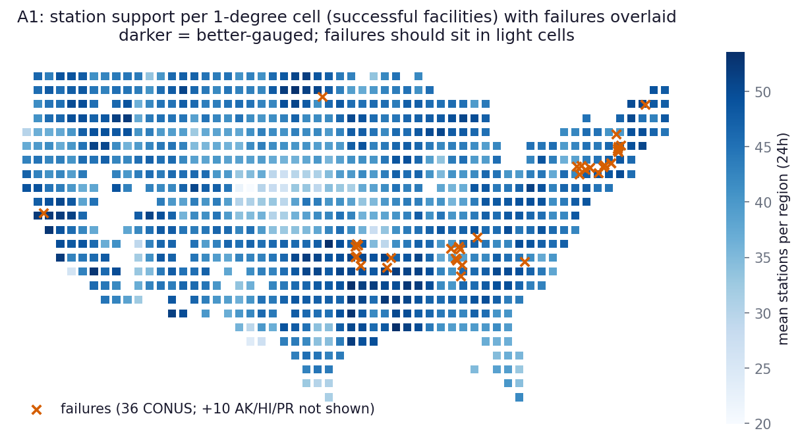

# A1 -- Failure atlas and gauge-desert map

_Generated 2026-08-16 20:31 UTC by `analysis/a1_failure_atlas.py`. Public-safe per the analysis
plan's boundary: failure locations are method-failure facts (the pipeline produced
NOTHING for these facilities), not vulnerability rankings; monitoring-gap
candidates are aggregated to 1-degree cells and states, never per dam._

**Partial data.** Input pinned to fleet-branch commit `b7207450f61518acd022204b178fdfb55fef9313` (`claude/desktop-nid-ad-hoc`), N = 31,250 of 73,303 facilities attempted (42.6%). The fleet runs largest-storage-first, so this partial sample over-represents large dams; refresh every artifact at fleet completion before treating any number here as final.

## QC gate

- Integrity hard-fail facilities excluded: 0 (pass rate 100.00%).
- 12 facilities with coordinate flags (`qc/reports/sanity_flags.csv`)
  excluded from all map layers -- their plotted position would be wrong.
- Register items touched: 7 (failures are reported, not silent -- this analysis IS
  that item), 2 (coordinates unverified), 6 (timeout tranches never wrote partial
  rows, so the failure set is complete for attempted facilities).

## Headline numbers

- Failures: **46 of 31,238 attempted (0.15%)** at this
  stage of the run. This is far below the ~15% the BOR-308 subset saw, for two
  reasons that must temper every conclusion below: (1) the fleet runs
  largest-storage-first, and large dams sit disproportionately in well-gauged
  basins; (2) 272 early "failures" were the elevation-band config bug
  (fixed in `603224c3`) and were requeued -- they are not method failures.
- Per-facility failure *reasons* are *not* in the committed ledger (only ok
  TRUE/FALSE); progress.md attributes failures to "too-few-stations etc.".
  **Recommendation for the completion pass: persist the per-facility failure
  reason** the way the BOR-308 run's `batch_status.csv` did.

## Where the method fails

Failures by state (all states with >=1 failure):

| State | attempted | failed | rate |
|---|---|---|---|
| AK | 48 | 10 | 20.83% |
| OK | 2,386 | 6 | 0.25% |
| NH | 327 | 6 | 1.83% |
| TN | 490 | 6 | 1.22% |
| NY | 807 | 4 | 0.50% |
| MA | 658 | 3 | 0.46% |
| AR | 579 | 2 | 0.35% |
| CT | 341 | 2 | 0.59% |
| KY | 401 | 1 | 0.25% |
| AL | 580 | 1 | 0.17% |
| CA | 1,012 | 1 | 0.10% |
| ND | 349 | 1 | 0.29% |
| NC | 165 | 1 | 0.61% |
| ME | 397 | 1 | 0.25% |
| PA | 700 | 1 | 0.14% |

Reading (at this commit):

- **Alaska is the standout gauge desert**: 21% of attempted AK
  facilities fail outright -- consistent with GHCN-Daily's thin AK coverage and
  the 20-yr record screen.
- **Honest negative on the BOR Oklahoma pattern**: 6 of 8 BOR-308 failures were
  in OK, but at fleet scale OK's failure rate is only 0.25% of 2,386 attempted -- ~1.7x the national 0.15%, a
  modest elevation, not a hot spot. The BOR-subset concentration now looks like
  small-N coincidence amplified by the BOR manifest's OK exposure rather than a
  dramatic regional data gap; re-test at completion.
- **RESOLVED (2026-08-18): the New England cluster was a legacy
  misclassification, not a real pattern.** Live re-run of Quabbin Spillway
  (MA00589) under current fleet code: 60 candidates, H1 = -0.06/-0.99,
  clean success. These failures (ledger positions 74-617) predate the
  2026-08-11 elevation-band fix (`603224c3`); that fix requeued only
  zero-candidate victims, while dams that scraped 3-4 mountain-fringe
  stations under the old [600,2600] band were misclassified "genuine
  sparse" and never requeued. The same applies to most TN/OK/KY/AL/NC
  legacy failures. Remediation: all ok=FALSE rows are requeued at
  completion (runbook step 2); genuinely sparse basins (AK) will re-fail
  honestly under the wide band.
- **An unexpected New England cluster** (12 failures across NH/MA/CT and
  neighbors) sits in a region that is NOT gauge-sparse on the support map --
  candidate explanations are the 20-yr 72h-completeness screen thinning dense
  but short-record station sets, or aggressive discordancy pruning; this is the
  first thing to investigate when per-facility failure reasons are persisted.

## Is the clustering real, or just station sparsity?

**The null the plan demands:** failures occur where usable stations are sparse
*almost by construction* (too-few-stations is the dominant failure mode), so
"failures cluster" is not by itself a finding. Observed mean nearest-neighbour
distance among the 46 failures: **156 km**.

- vs a **uniform** null (random 46-subsets of attempted facilities,
  2000 draws): one-sided p = 0.029 (clustered beyond uniform).
- vs a **station-sparsity-weighted** null (draw probability proportional to
  1/(1+local station count)): one-sided p = 0.019 (clustering EXCEEDS what sparsity alone explains).

With only 46 failures the power of this test is low; it will be re-run at
completion when the failure set is an order of magnitude larger. Spatial-pattern
caveat: facilities within ~175 km share candidate stations, so failure events are
not independent observations -- p-values here are descriptive, not inferential.

## Gauge deserts (aggregate monitoring-gap candidates)

Station support among successes: median 46 stations
per 24h region, 5th percentile 33. The lowest-support 1-degree
cells (>=5 facilities) -- candidate monitoring gaps, aggregate only:

| cell (lat, lon) | facilities | mean stations |
|---|---|---|
| (40, -105) | 65 | 19.9 |
| (40, -106) | 157 | 22.1 |
| (55, -132) | 9 | 23.9 |
| (40, -102) | 12 | 26.3 |
| (41, -102) | 8 | 27.0 |
| (37, -94) | 11 | 27.5 |
| (40, -103) | 17 | 27.9 |
| (21, -160) | 12 | 29.0 |
| (40, -99) | 36 | 29.1 |
| (22, -160) | 11 | 29.1 |
| (41, -103) | 6 | 29.3 |
| (36, -93) | 8 | 29.4 |
| (41, -101) | 9 | 29.7 |
| (40, -104) | 13 | 30.0 |
| (26, -99) | 26 | 30.0 |

Failure concentrations by 1-degree cell:

| cell (lat, lon) | state | failures |
|---|---|---|
| (43, -72) | NH | 5 |
| (42, -73) | MA | 3 |
| (51, -177) | AK | 3 |
| (36, -86) | TN | 2 |
| (35, -96) | OK | 2 |
| (35, -87) | TN | 2 |
| (36, -96) | OK | 2 |
| (41, -75) | NY | 2 |
| (71, -157) | AK | 2 |
| (68, -163) | AK | 2 |

## Pinned inputs

- Fleet data: `b7207450f61518acd022204b178fdfb55fef9313` (`claude/desktop-nid-ad-hoc`)
- QC: `qc/reports/integrity_flags.csv`, `qc/reports/sanity_flags.csv` at the same commit