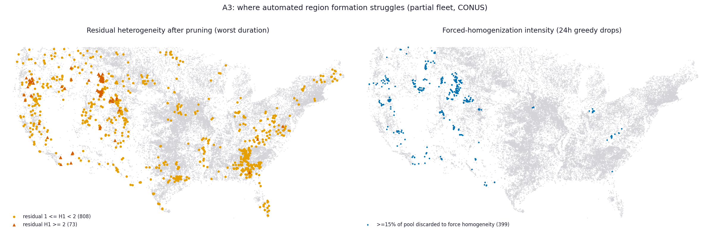

# Method diagnostics -- national fleet

_Aggregate method-diagnostic geography for the NID fleet run. Public-safe:
no per-dam vulnerability content. Sections are added as Phase-A/B analyses
complete; QC context lives in `qc/reports/`._

## A3 -- Heterogeneity hot-spots

_Generated 2026-08-16 20:32 UTC by `analysis/a3_heterogeneity.py`._

**Partial data.** Input pinned to fleet-branch commit `b7207450f61518acd022204b178fdfb55fef9313` (`claude/desktop-nid-ad-hoc`), N = 31,250 of 73,303 facilities attempted (42.6%). The fleet runs largest-storage-first, so this partial sample over-represents large dams; refresh every artifact at fleet completion before treating any number here as final.

### QC gate

- 31,204 ok facilities pass integrity QC (100.00%);
  12 coordinate-flagged facilities excluded from map layers.
- Forced-homogenization layer covers the 30,685 facilities with station-audit
  files (the 519 pre-centralization facilities lack them; integrity report A2b).
- Register items: 3 (circular-only regions -- a different region method would
  change WHERE pruning is needed), 2 (bad coordinates put facilities on the
  wrong side of a gradient; the C1 flags matter most exactly here).

### The two-layer picture

The engine greedily prunes discordant stations until H1 < 1, so *final* H1 is
homogeneous almost everywhere -- 
only 902 facilities (2.9%) retain H1 >= 1 in their worst
duration and just 73 exceed 2. Residual H1 alone would therefore say "no
problem", which is exactly the Keene lesson in reverse: **where the gradient is
sharp, the cost shows up as discarded stations, not as a bad final statistic.**
Nationally 21% of facilities needed at least one greedy drop at 24h,
and 423 discarded >=15% of their candidate pool to reach
homogeneity.

### Hot-spot cells (aggregate, >=10 facilities)

| cell (lat, lon) | state (mode) | facilities | mean pool fraction discarded |
|---|---|---|---|
| (44, -110) | WY | 18 | 27.2% |
| (42, -110) | WY | 20 | 21.9% |
| (43, -116) | ID | 14 | 21.9% |
| (43, -109) | WY | 19 | 20.6% |
| (44, -122) | OR | 10 | 19.7% |
| (42, -109) | WY | 11 | 19.4% |
| (46, -115) | MT | 12 | 19.3% |
| (44, -112) | ID | 16 | 17.6% |
| (41, -108) | WY | 23 | 17.5% |
| (44, -109) | WY | 25 | 15.6% |
| (36, -109) | NM | 13 | 14.9% |
| (43, -117) | ID | 20 | 14.2% |

### Alignment with known climate gradients (qualitative)

Read against a physical map (at this commit):

- **Forced homogenization is almost entirely a mountain-West phenomenon**: the
  northern Rockies (MT/ID/WY densest), the Colorado Rockies and Wasatch, the
  Great Basin ranges, and the Cascade/Sierra and coastal-California transitions.
  East of about the 100th meridian heavy pruning is rare -- the Cascade-
  transition lesson generalizes: sharp orographic gradients are what defeat
  circular region formation.
- **Residual heterogeneity has a second, eastern mode the pruning layer lacks**:
  besides the same mountain-West belt, clusters sit over the Cumberland Plateau
  (southern TN / northern AL), the Missouri Ozarks, the Adirondack/Green-Mountain
  area, and peninsular Florida. There the pool is large and pruning mild, yet
  H1 stays above 1 -- suggesting mixed storm populations (tropical vs frontal,
  lake-effect) rather than terrain, a different failure mode deserving its own
  review attention.
- The flat interior (central plains, upper Midwest) is quiet in both layers.

This is a qualitative overlay; **no spatial statistic is claimed**: facilities
within ~175 km share candidate stations, so neighboring drop fractions are
dependent by construction, and a station-blocked test belongs to the completion
pass.

### Use for review prioritization

These hot-spots are where per-facility expert review (checklist sections 2-3,
region-map inspection for divide-crossing and rain-shadow violations) matters
most; the D1 stratified sample should oversample high-drop-fraction cells, and
the 902 residual-H1 facilities plus the 423 heavy-pruning
facilities are natural members of its high-H1 stratum.

### Pinned inputs

- Fleet data: `b7207450f61518acd022204b178fdfb55fef9313` (`claude/desktop-nid-ad-hoc`)
- QC: `qc/reports/integrity_flags.csv`, `qc/reports/sanity_flags.csv`