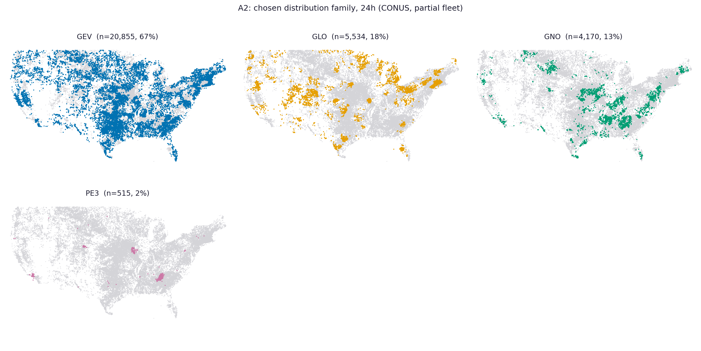
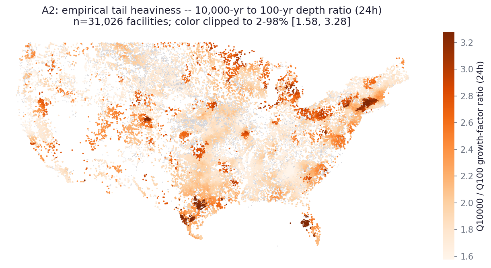
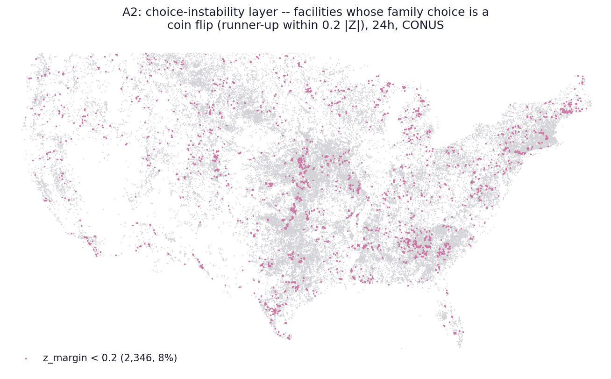

# A2 -- Tail-behavior geography

_Generated 2026-08-16 20:31 UTC by `analysis/a2_tail_geography.py`. Public-safe: aggregate
distribution-family geography and depth *ratios*; no per-dam depth rankings._

**Partial data.** Input pinned to fleet-branch commit `b7207450f61518acd022204b178fdfb55fef9313` (`claude/desktop-nid-ad-hoc`), N = 31,250 of 73,303 facilities attempted (42.6%). The fleet runs largest-storage-first, so this partial sample over-represents large dams; refresh every artifact at fleet completion before treating any number here as final.

## QC gate

- Facilities passing integrity QC: 31,204 of 31,204 ok
  (100.00%); 12 coordinate-flagged facilities dropped from
  map layers (kept in national statistics -- their diagnostics are position-
  independent, only their dots would be misplaced).
- Tail index computed from growth curves (site_id-exact) for 30,685 facilities + 470 pre-centralization
  facilities backfilled via unique-name DDF ratios; the remaining
  49 (collided-name pre-centralization) excluded.
- The 72h<24h crossing flag (sanity report) does not touch this analysis: all
  quantities here are 24h-only and within-duration monotonicity is clean.
- Register items: 3 (circular-only regions -- family choice could shift under the
  region-method band; the instability layer below is the honest cousin of that
  caveat), 5 (undercatch biases mountain depths low; ratios are less exposed than
  absolute depths).

## Distribution-family geography

| Family | NID fleet share | BOR-308 share |
|---|---|---|
| GEV | 0.669 | 0.564 |
| GLO | 0.178 | 0.302 |
| GNO | 0.136 | 0.125 |
| PE3 | 0.017 | 0.010 |
| GPA | 0.000 | 0.000 |

## Empirical tail heaviness (Q10000/Q100, 24h)

National median ratio 1.94 (p05 1.64, p95 2.94).

Heaviest / lightest tails by state (median ratio, n>=100):

| Heaviest | median | n | | Lightest | median | n |
|---|---|---|---|---|---|---|
| FL | 3.18 | 572 | | ID | 1.71 | 243 |
| CT | 2.91 | 339 | | NM | 1.71 | 238 |
| MI | 2.55 | 580 | | GA | 1.71 | 1,472 |
| VT | 2.43 | 172 | | MS | 1.73 | 1,061 |
| UT | 2.42 | 328 | | AR | 1.75 | 576 |
| MA | 2.35 | 655 | | SD | 1.76 | 613 |
| NJ | 2.27 | 238 | | IL | 1.77 | 122 |
| VA | 2.26 | 618 | | IN | 1.77 | 424 |

Reading (at this commit): the heavy-tail geography is led by **Florida** and the
**coastal Northeast** (CT/MA/VT/NJ) -- both consistent with tropical-system
extremes riding on a moderate everyday climate -- with sub-state hot spots the
state medians dilute: the central-Texas flash-flood alley, the Missouri Ozarks,
and a strong Hudson-Valley/Berkshires blob are all visible on the map. Interior
and Gulf-inland states (GA, MS, AR, ID, NM) run light. **Michigan's high median
is unexpected** and worth a targeted look in the D1 review sample -- it may be a
lake-effect / short-record artifact rather than climate signal. Note also that
tail ratio and chosen family are entangled (GLO is the heaviest-tailed family),
so family-choice instability (below) propagates into this map.

## Choice stability

**8% of facilities chose their distribution family by a margin
of less than 0.2 |Z|** -- for these the family label on the map above is
close to arbitrary, and (per the BOR region-method work) they carry the largest
method sensitivity in the extrapolated tail. Most frequent coin-flip pairs
(chosen vs runner-up):

| Chosen | Runner-up | n |
|---|---|---|
| GEV | GLO | 615 |
| GEV | GNO | 605 |
| GLO | GEV | 569 |
| GNO | GEV | 478 |
| GNO | PE3 | 60 |
| PE3 | GNO | 49 |

## Verification notes (QAQC plan section E)

- **Spatial-autocorrelation caveat**: facilities within ~175 km share candidate
  stations, so neighboring facilities' family choices and ratios are strongly
  dependent by construction. Apparent regional coherence on these maps is partly
  that sharing; no significance is claimed for any spatial pattern here, and
  none should be inferred until a station-blocked test is run at completion.
- **Selection caveat**: largest-storage-first ordering means sparsely-dammed
  (often mountainous) areas are already sampled while small-dam-dense areas
  (e.g. the Southeast) are under-sampled at 42.6%.
- The family-share difference vs BOR-308 is expected from geography (BOR is
  interior-West-heavy); the sanity report's profile comparison carries the
  distribution-level view.

## Pinned inputs

- Fleet data: `b7207450f61518acd022204b178fdfb55fef9313` (`claude/desktop-nid-ad-hoc`)
- QC: `qc/reports/integrity_flags.csv`, `qc/reports/sanity_flags.csv`