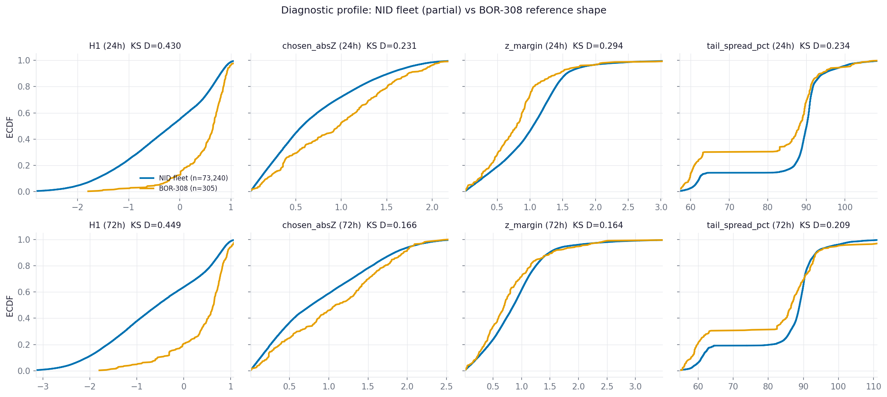
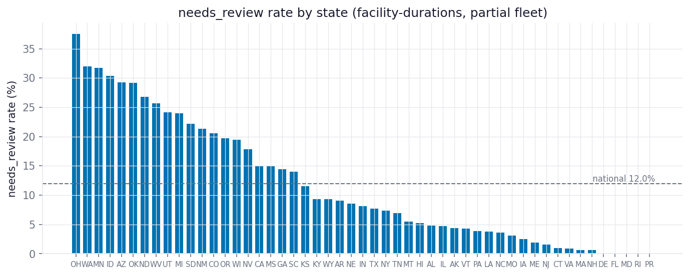
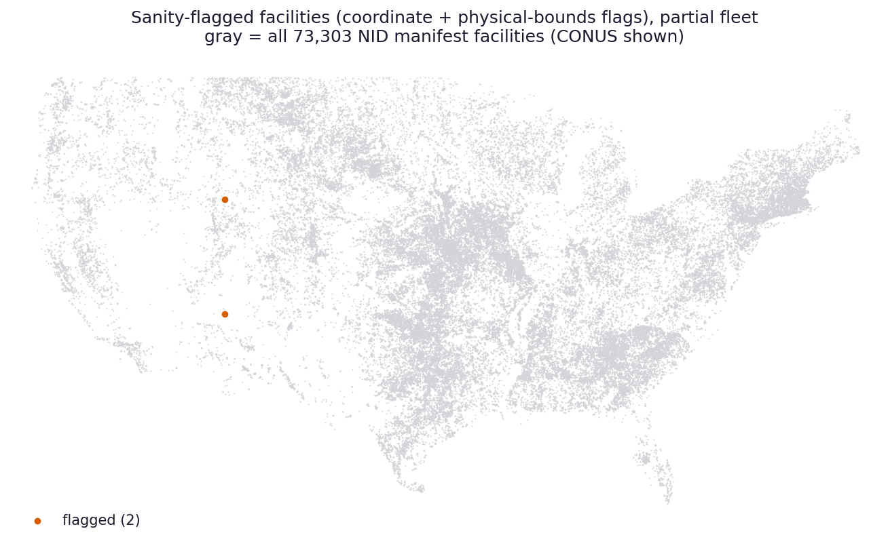

# NID fleet -- statistical + coordinate sanity report (QAQC plan sections B, C1)

_Generated 2026-08-23 14:36 UTC by `qc/nid_qc_sanity.py`._

**Partial data.** Input pinned to fleet-branch commit `74db38c0574e2f15d3caecfa5d299f989f12b74c` (`claude/desktop-nid-ad-hoc`), N = 73,303 of 73,303 facilities attempted (100.0%). The fleet runs largest-storage-first, so this partial sample over-represents large dams; refresh every artifact at fleet completion before treating any number here as final.

Flags are advisory ("flags not drops"); the machine-readable copy is
`qc/reports/sanity_flags.csv` (14,019 rows).

## Verdicts

| Check | Verdict | Detail |
|---|---|---|
| B1 monotonicity + 72h>=24h | **FAIL** | within-duration monotonicity CLEAN (145,442 growth curves, 123,790 DDF curves, 0 violations); BUT 72h<24h duration crossings at 8,679 of 58,516 unique-name sites (14.8%) -- all at T>=200; diagnosed as an engine limitation (24h and 72h fitted independently with no cross-duration consistency constraint), not a corrupt fold; see the crossing section below |
| B2 physical bounds | **PASS** | 100yr/24h out-of-bounds: 0 of 58,516 attributable facilities (CONUS: 0/58286, AK: 0/62, HI: 0/133, PR: 0/35); CI-ordering violations: 0; tail-band ordering violations: 0. (3379 collided site names excluded from state attribution) |
| B3 profile vs BOR-308 reference | **WARN** | max KS D across 8 metric/duration cells = 0.449 (reference = docs/example_outputs/fleet_308dam/batch_diagnostics.csv; data/region_method_band/bor308_band.csv is not on main -- unmerged PR); see figures/profile_vs_bor308.png |
| B4 needs_review accounting | **WARN** | national needs_review rate 12.0% of facility-durations; states >max(2x national, +5pp) with n>=100: AZ 29.2% (n=626.0), ID 30.4% (n=826.0), MI 24.0% (n=1774.0), MN 31.7% (n=1944.0), ND 26.8% (n=1634.0), OH 37.5% (n=2516.0), OK 29.1% (n=9428.0), UT 24.1% (n=1222.0), WA 32.0% (n=1552.0), WV 25.7% (n=826.0) |
| C1 coordinate sanity | **WARN** | 3 of 73,303 attempted facilities flagged (bbox test with 1.0 deg buffer; polygon-accurate test deferred to completion pass); non-CONUS attempted: 264 ({'HI': 134, 'AK': 95, 'PR': 35}) |

## Flag counts

| Flag | Severity | Rows |
|---|---|---|
| `coord_missing` | FAIL | 1 |
| `coord_outside_state_bbox` | WARN | 2 |
| `ddf_depth_not_monotonic` | FAIL | 5,337 |
| `dur72_lt_dur24` | FAIL | 8,679 |

## The 72h < 24h duration-crossing finding (B1)

Within-duration monotonicity is perfectly clean, but at 8,679 of
58,516 unique-name sites (14.8%) the fitted
72-h depth drops below the 24-h depth somewhere in the extrapolated tail --
physically impossible for nested annual maxima, so it is a pure artifact of the
engine fitting each duration **independently** (different station sets after the
20-yr record screen, different regions after the H1 homogeneity pruning, and
often a different chosen distribution family) with no cross-duration consistency
constraint.

| T (yr) | crossing sites |
|---|---|
| 200 | 243 |
| 500 | 1,769 |
| 1000 | 3,328 |
| 2000 | 5,111 |
| 5000 | 7,165 |
| 10000 | 8,679 |

Deficit (24h minus 72h, % of 24h) across crossing (site, T) pairs: median 7.2%, p75 15.4%, max 44.1%.

Supporting evidence for the independent-fit diagnosis: at crossing sites the
24h and 72h fits chose **different** distribution families 69%
of the time, vs 35% at non-crossing sites.

Consequences: (1) every crossing site carries a hard `dur72_lt_dur24` flag (the
plan's rule); (2) no crossing occurs below T=200, so 100-yr products are
unaffected; (3) T>=200 **72h** depths at flagged sites should not be used
without a cross-duration consistency fix or an explicit caveat; (4) the
crossing rate itself is a measure of independent-fit tail uncertainty and is
worth reporting alongside the tail_spread diagnostics.

## B3: diagnostic profile vs the BOR-308 reference shape

Reference used: `docs/example_outputs/fleet_308dam/batch_diagnostics.csv`
(the curated BOR-308 fleet diagnostics committed on main).
`data/region_method_band/bor308_band.csv` was specified as an alternative but
is **not on main** (it lives on the unmerged region-methods PR branch), so the
example-outputs diagnostics file is the benchmark, as the closest validated
reference actually available.

KS D statistics (distribution-shape distance, 0 = identical; with n≈31k any
difference is 'significant', so D itself is the honest quantity):

| Duration | Metric | n fleet | n BOR | KS D |
|---|---|---|---|---|
| 24h | H1 | 73,240 | 305 | 0.430 |
| 24h | chosen_absZ | 73,240 | 305 | 0.231 |
| 24h | z_margin | 73,240 | 305 | 0.294 |
| 24h | tail_spread_pct | 73,240 | 305 | 0.234 |
| 72h | H1 | 73,240 | 305 | 0.449 |
| 72h | chosen_absZ | 73,240 | 305 | 0.166 |
| 72h | z_margin | 73,240 | 305 | 0.164 |
| 72h | tail_spread_pct | 73,240 | 305 | 0.209 |

Quantiles (q05 | q25 | q50 | q75 | q95):

| Duration | Metric | Series | q05 | q25 | q50 | q75 | q95 |
|---|---|---|---|---|---|---|---|
| 24h | H1 | NID fleet | -1.96 | -0.98 | -0.17 | 0.54 | 0.89 |
| 24h | H1 | BOR-308 | -0.4 | 0.33 | 0.65 | 0.82 | 0.98 |
| 24h | chosen_absZ | NID fleet | 0.05 | 0.27 | 0.57 | 1.07 | 1.75 |
| 24h | chosen_absZ | BOR-308 | 0.11 | 0.39 | 0.98 | 1.4 | 1.97 |
| 24h | z_margin | NID fleet | 0.13 | 0.64 | 1.05 | 1.34 | 1.81 |
| 24h | z_margin | BOR-308 | 0.09 | 0.46 | 0.8 | 1.01 | 1.75 |
| 24h | tail_spread_pct | NID fleet | 61.1 | 87.9 | 90.1 | 91.3 | 99.1 |
| 24h | tail_spread_pct | BOR-308 | 58.3 | 62.6 | 88.2 | 90.8 | 100.24 |
| 72h | H1 | NID fleet | -2.38 | -1.44 | -0.56 | 0.44 | 0.89 |
| 72h | H1 | BOR-308 | -0.97 | 0.23 | 0.64 | 0.8 | 1.02 |
| 72h | chosen_absZ | NID fleet | 0.06 | 0.33 | 0.78 | 1.42 | 2.07 |
| 72h | chosen_absZ | BOR-308 | 0.13 | 0.51 | 1.08 | 1.6 | 2.07 |
| 72h | z_margin | NID fleet | 0.12 | 0.52 | 0.86 | 1.17 | 1.82 |
| 72h | z_margin | BOR-308 | 0.11 | 0.41 | 0.7 | 1.08 | 2.05 |
| 72h | tail_spread_pct | NID fleet | 59.6 | 85.1 | 88.9 | 90.7 | 98.2 |
| 72h | tail_spread_pct | BOR-308 | 56.32 | 61.1 | 86.6 | 91.4 | 99.76 |

Distribution-family share at 24 h (fraction of facilities):

| Family | NID fleet | BOR-308 |
|---|---|---|
| GEV | 0.687 | 0.564 |
| GLO | 0.144 | 0.302 |
| GNO | 0.149 | 0.125 |
| PE3 | 0.020 | 0.010 |

Interpretation caveats: the BOR-308 set is ~300 large federal dams (many in
the interior West), while the partial NID fleet is the ~31k largest-storage
dams nationally -- some profile difference is expected from geography alone,
not only from method behavior. A national profile wildly different from the
validated subset would still be a finding to explain before use (plan B3);
the comparison above is the check.

## B4: needs_review by state

## C1: coordinate sanity

In-state test uses generous state bounding boxes with a 1.0 deg buffer -- a coarse screen for gross errors (sign slips,
transpositions, wrong state). A polygon-accurate in-state / open-water test is
deferred to the completion pass. Known-issue register item 2 (NID mirror
coordinates unverified) applies to every facility regardless of flags here.

## Known-issue register propagation

Touches register items 2 (coordinates -- C1), 4 (elevation NA -- degrades the
index-flood regression fleet-wide; bounds in B2 remain valid screens), and 5
(gauge undercatch biases mountain depths low -- bounds are generous enough that
undercatch cannot flip a pass/fail).

## Pinned inputs

- Fleet data: `74db38c0574e2f15d3caecfa5d299f989f12b74c` (`claude/desktop-nid-ad-hoc`)
- BOR-308 reference: `docs/example_outputs/fleet_308dam/batch_diagnostics.csv` (main)